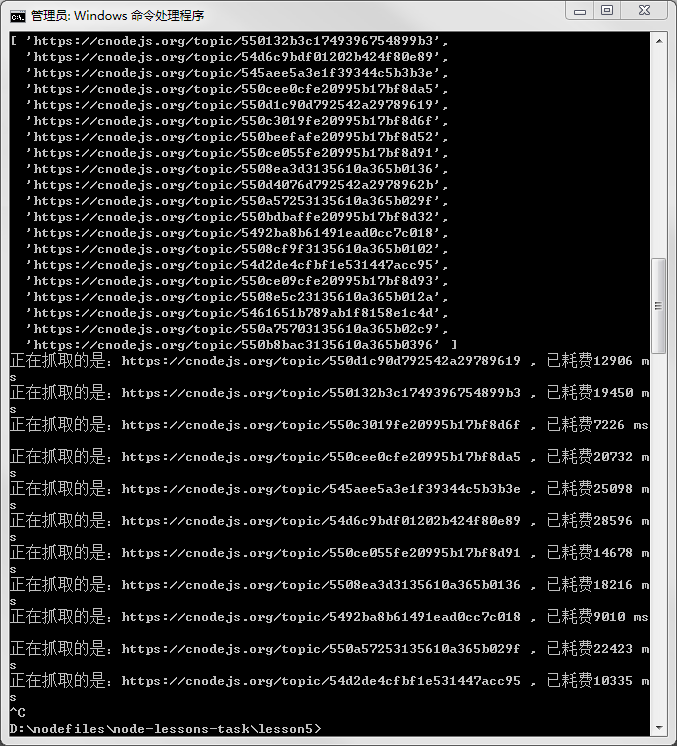
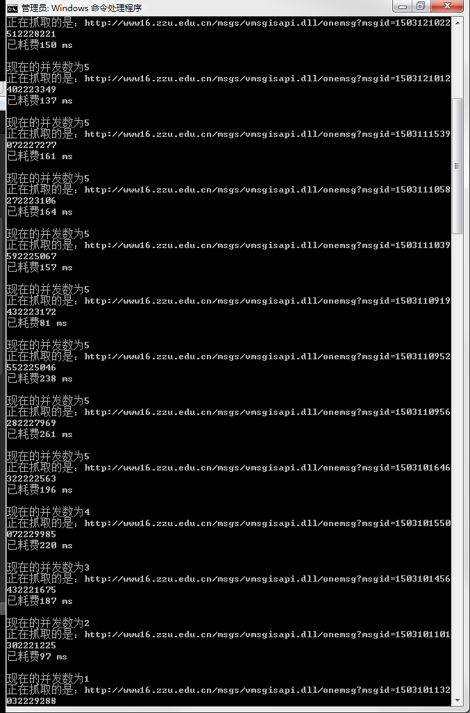
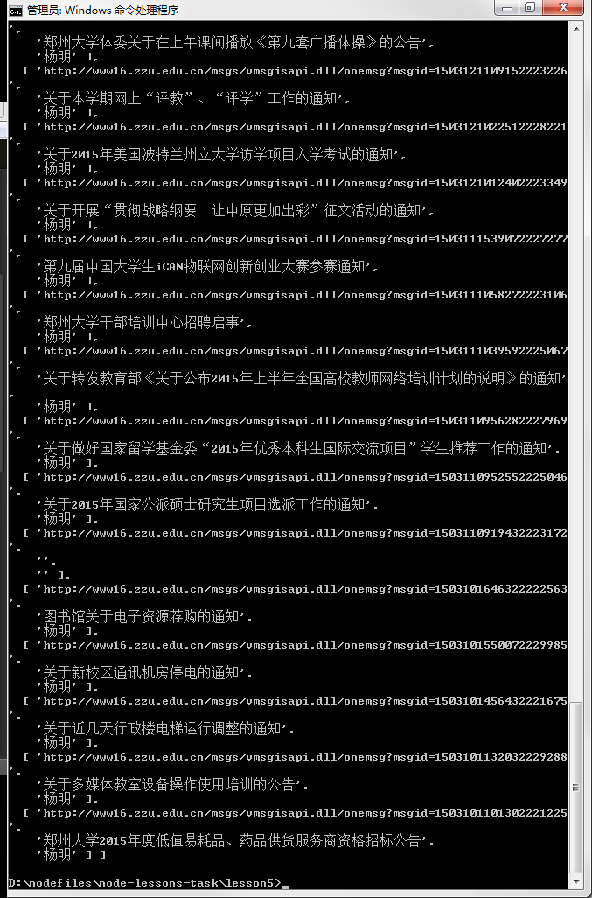
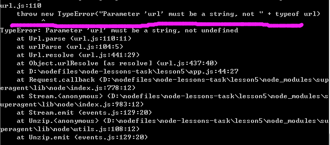

#使用 async 控制并发

##目标

好不容易成功了，校园网实在是太渣，爬https://cnodejs.org/实在是无力。

所以，我决定爬学校内部网，嘿嘿。

但是速度太喵的快了。

##踩的坑

究其原因还是在于async的API不熟悉,代码写的恶心的一逼。

[async_demo](https://github.com/bsspirit/async_demo)这个是神器！！！

##反思

1. 一开始纠结于将 iterator 函数化出来，结果发现思路很不清晰。加之与提示并发量的代码混在一起，导致头脑一片混乱。
