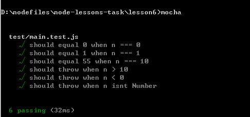
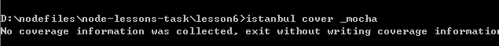
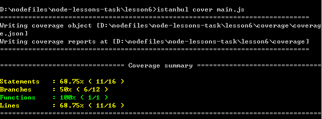
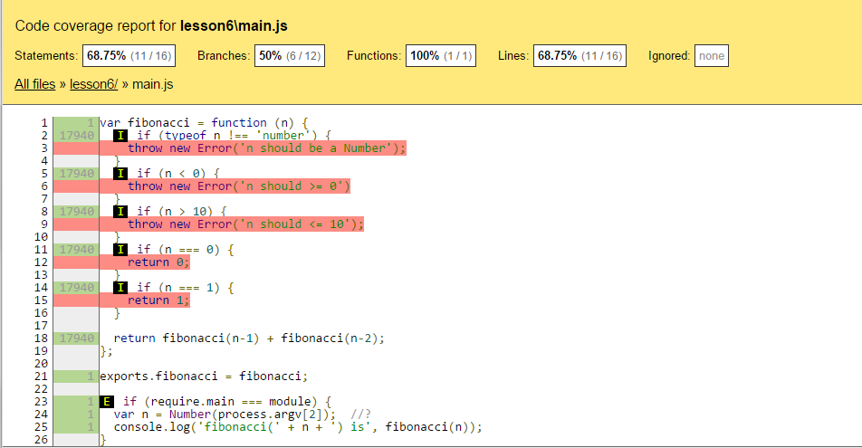
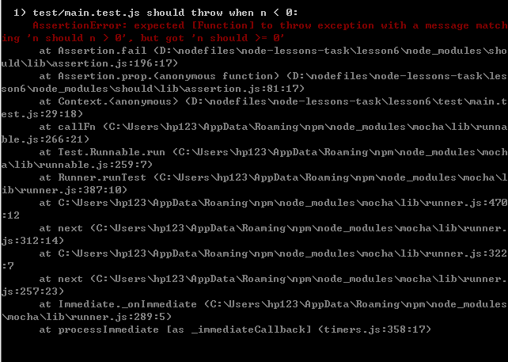

#测试用例：mocha，should，istanbul

##目标

如下提示，是因为istanbul的操作命令与教程不符。应为`istanbul cover main.js`

##坑

**千万记得加“ ; ”,以及认真书写代码**

##扩展阅读
http://www.cnblogs.com/coderzh/archive/2009/07/26/1531633.html

http://teddy-chen-tw.blogspot.com/2014/09/bddtdd.html

http://www.infoq.com/cn/articles/test-coverage-rate-role

http://coolshell.cn/articles/8209.html

http://blog.csdn.net/haoel/article/details/2886

2015.3.22